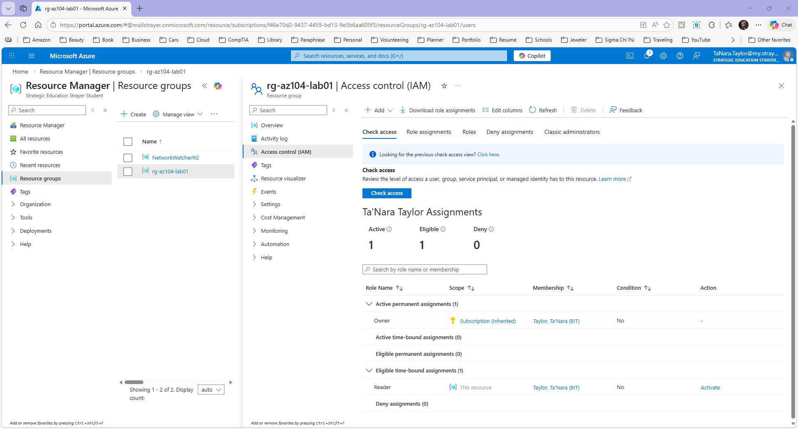

# Project 3 — Azure Role-Based Access Control (RBAC)

## Skills Demonstrated

- Microsoft Entra ID user management
- Azure Role-Based Access Control (RBAC)
- Least privilege access model
- Resource group permission assignment

## Architecture

Azure Subscription
│
├─ Resource Group
│
├─ Storage Account
│
└─ RBAC
     └─ Reader role assignment configured

## Steps Performed

1. Navigated to the Azure resource group used for the administration lab environment.
2. Opened **Access Control (IAM)** to manage role assignments.
3. Reviewed available Azure built-in roles.
4. Assigned the **Reader** role at the resource group scope.
5. Verified the role assignment within the IAM role assignments panel.
6. Demonstrated Azure RBAC permission management and least-privilege access principles.

## Security Concept

This project demonstrates implementing least privilege access by assigning read-only permissions to a user at the resource group scope.

## Azure Services Used

- Microsoft Azure
- Azure Resource Groups
- Azure Role-Based Access Control (RBAC)
- Access Control (IAM)
  
## Result

The user can view resources but cannot create, modify, or delete them.

## Verification

Role assignment successfully configured in Azure Access Control (IAM).

